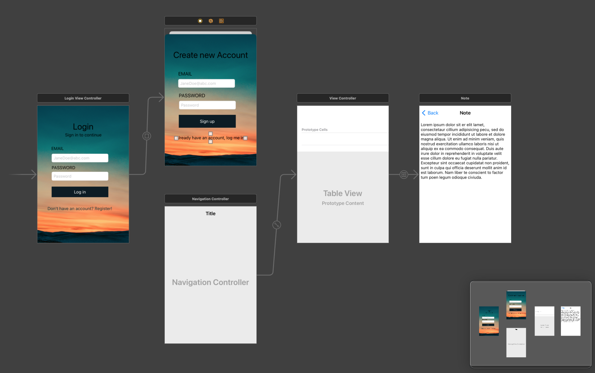
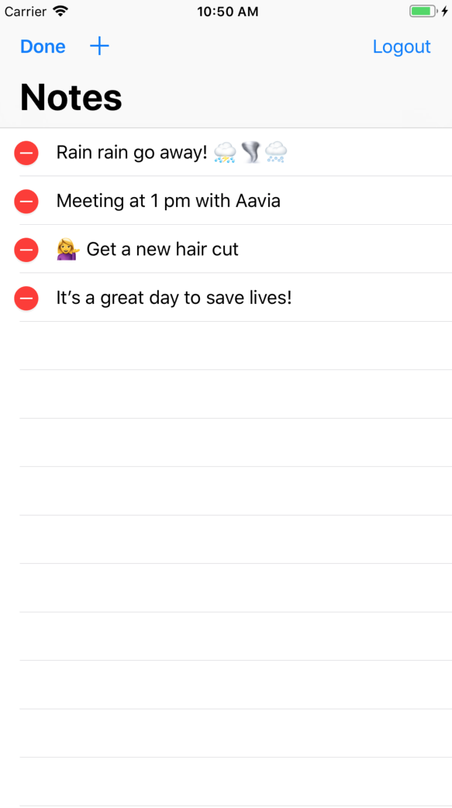
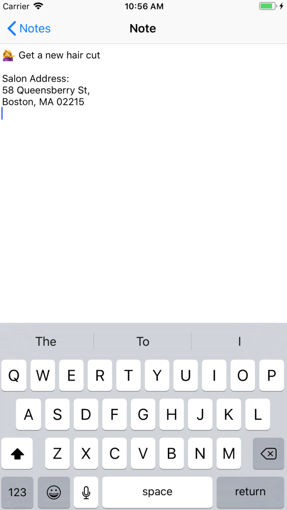

# note-it
A simple note-taking iOS app using Swift and Xcode

# Summary
- A simple 2-screen note-taking iOS app using Swift and Xcode
- The first page shows all the notes 
- The second page is for viewing, editing, or creating a note
- The notes are backed up to the Cloud using Firebase in the backend
- Includes a login functionality along with touch id so that the app can be accessed across devices
- The code follows Apple's Model-View-Controller and Delegates rules

 

